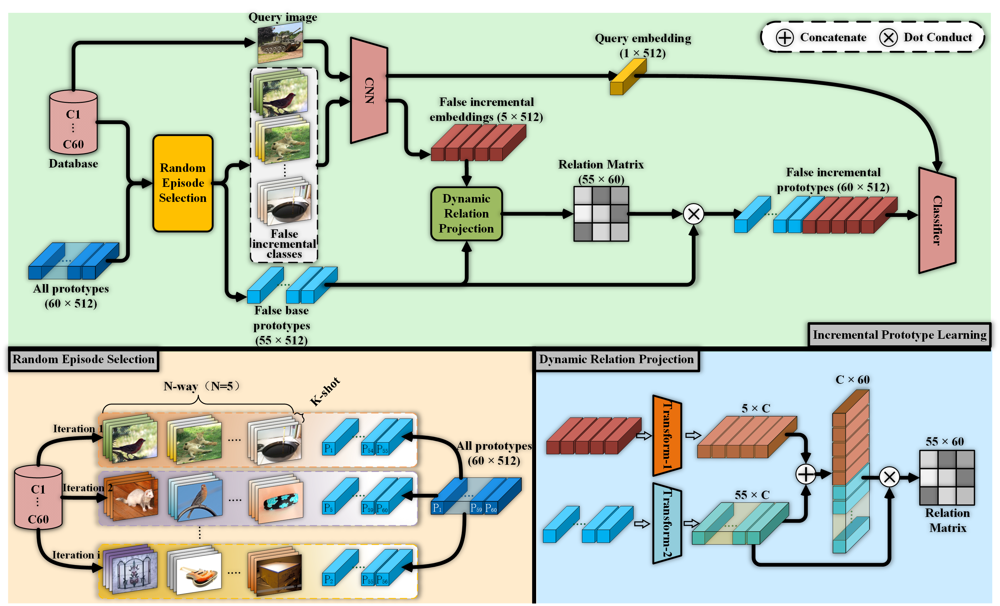

## Self-Promoted Prototype Refinement for Few-Shot Class-Incremental Learning
This is the implementation of the paper "Self-Promoted Prototype Refinement for Few-Shot Class-Incremental Learning" (accepted to CVPR2021).

<p align="middle">
    
</p>

For more information, check out the paper on [[arXiv](https://arxiv.org/abs/2107.08918)].

## Requirements

- Python 3.8
- PyTorch 1.8.1 (>1.1.0)
- cuda 11.2

## Preparing Few-Shot Class-Incremental Learning Datasets
Download following datasets:

> #### 1. CIFAR-100
> Automatically downloaded on torchvision.

> #### 2. MiniImageNet
> (1) Download MiniImageNet train/test images[[github](https://github.com/yaoyao-liu/mini-imagenet-tools)],
> and prepare related datasets according to [[TOPIC](https://github.com/xyutao/fscil)].
>
> (2) or Download processed data from our Google Drive: [[mini-imagenet.zip](https://drive.google.com/drive/folders/1VY4RVXZUc4sc9sDRmk70RRamyWQkU_Z_?usp=sharing)],
> (and locate the entire folder under datasets/ directory).

> #### 3. CUB200
> (1) Download CUB200 train/test images, and prepare related datasets according to [[TOPIC](https://github.com/xyutao/fscil)]:
> ```bash
> wget http://www.vision.caltech.edu/visipedia-data/CUB-200-2011/CUB_200_2011.tgz
> ```
> (2) or Download processed data from our Google Drive: [[cub.zip](https://drive.google.com/drive/folders/1VY4RVXZUc4sc9sDRmk70RRamyWQkU_Z_?usp=sharing)],
> (and locate the entire folder under datasets/ directory).

Create a directory '../datasets' for the above three datasets and appropriately place each dataset to have following directory structure:

    ../                                                        # parent directory
    ├── ./                                           # current (project) directory
    │   ├── log/                              # (dir.) running log
    │   ├── pre/                              # (dir.) trained models for test.
    │   ├── utils/                            # (dir.) implementation of paper 
    │   ├── README.md                          # intstruction for reproduction
    │   ├── test.sh                          # bash for testing.
    │   ├── train.py                        # code for training model
    │   └── train.sh                        # bash for training model
    └── datasets/
        ├── CIFAR100/                      # CIFAR100 devkit
        ├── mini-imagenet/           
        │   ├── train/                         # (dir.) training images (from Google Drive)
        │   ├── test/                           # (dir.) testing images (from Google Drive)
        │   └── ..some csv files..
        └── cub/                                   # (dir.) contains 200 object classes
            ├── train/                             # (dir.) training images (from Google Drive)
            └── test/                               # (dir.) testing images (from Google Drive)

## Training
> Choose apporopriate lines in train.sh file.
> ```bash
> sh train.sh
> ```
> * '--base_epochs' can be modified to control the initial accuracy ('Our' vs 'Our*' in our paper).
> * Training takes approx. several hours until convergence (trained with one 2080 Ti or 3090 GPUs).

## Testing

> ### 1. Download pretrained models to the 'pre' folder.
> Pretrained models are available on our [[Google Drive](https://drive.google.com/drive/folders/1HX8nIDWlz8AVzqL2Fy6zqZg15SeDSGg3?usp=sharing)].


> ### 2. Test
> Choose apporopriate lines in test.sh file.
> ```bash
> sh test.sh 
> ```


## Main Results

The experimental results with 'test.sh 'for three datasets are shown below.

#### 1. CIFAR-100

|       Model       | 1  | 2 | 3 | 4 | 5 | 6 | 7 | 8 | 9 |
| :----------------: | :------: | :------: | :------: | :------: | :------: | :------: | :------: |:------: | :------: |
| iCaRL | 64.10 |  53.28  |  41.69  |  34.13  | 27.93  | 25.06  | 20.41 | 15.48  | 13.73 |
| TOPIC | 64.10 | 56.03 | 47.89 | 42.99 | 38.02 | 34.60 | 31.67 | 28.35  | 25.86 |
| Ours | 63.97 | 65.86 | 61.31 | 57.6 | 53.39 | 50.93 | 48.27 | 45.36  | 43.32 |

#### 2. MiniImageNet

|       Model       | 1  | 2 | 3 | 4 | 5 | 6 | 7 | 8 | 9 |
| :----------------: | :------: | :------: | :------: | :------: | :------: | :------: | :------: |:------: | :------: |
| iCaRL | 61.31 |  46.32  |  42.94  |  37.63  | 30.49  | 24.00  | 20.89 | 18.80  | 17.21 |
| TOPIC | 61.31 | 45.58 | 43.77 | 37.19 | 32.38 | 29.67 | 26.44 | 25.18  | 21.80|
| Ours | 61.45 | 63.80 | 59.53 | 55.53 | 52.50 | 49.60 | 46.69 | 43.79  | 41.92|

#### 3. CUB200

|       Model       | 1  | 2 | 3 | 4 | 5 | 6 | 7 | 8 | 9 | 10 | 11 |
| :----------------: | :------: | :------: | :------: | :------: | :------: | :------: | :------: |:------: | :------: |:------: | :------: |
| iCaRL | 68.68 |  52.65  |  48.61  |  44.16  | 36.62  | 29.52  | 27.83 | 26.26  | 24.01 | 23.89 | 21.16 |
| TOPIC | 68.68 | 61.01 | 55.35 | 50.01 | 42.42 | 39.07 | 35.47 | 32.87 | 30.04 | 25.91  | 24.85 |
| Ours | 68.05 | 62.01 | 57.61 | 53.67 | 50.77 | 46.76 | 45.43 | 44.53  | 41.74| 39.93  | 38.45 |

The presented results are slightly different from those in the paper, which are the average results of multiple tests. 
   
## BibTeX
If you use this code for your research, please consider citing:
````BibTeX
@inproceedings{zhu2021self,
  title={Self-Promoted Prototype Refinement for Few-Shot Class-Incremental Learning},
  author={Zhu, Kai and Cao, Yang and Zhai, Wei and Cheng, Jie and Zha, Zheng-Jun},
  booktitle={Proceedings of the IEEE/CVF Conference on Computer Vision and Pattern Recognition},
  pages={6801--6810},
  year={2021}
}
````
